# 项目介绍

基于 SSM（Spring+SpringMVC+Mybatis）的 B2C 商城。

## 业务流程

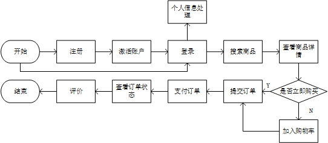

下面是效果图
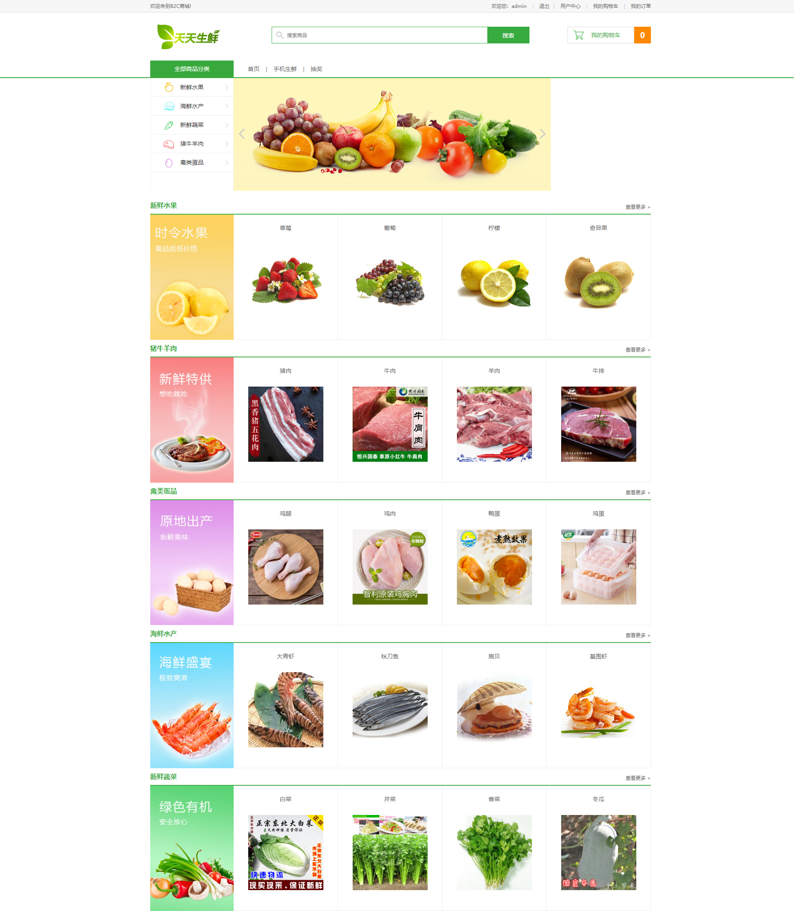
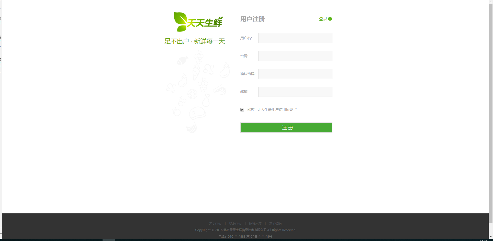
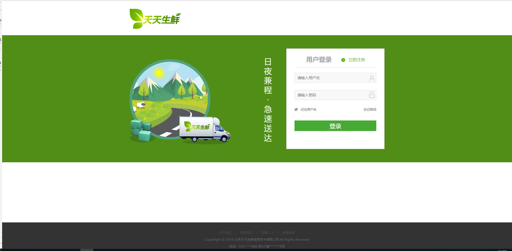
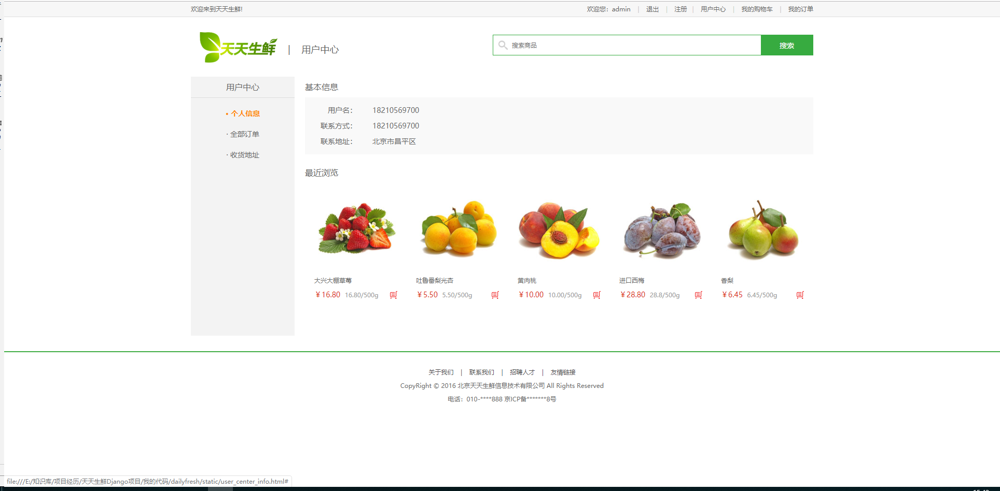
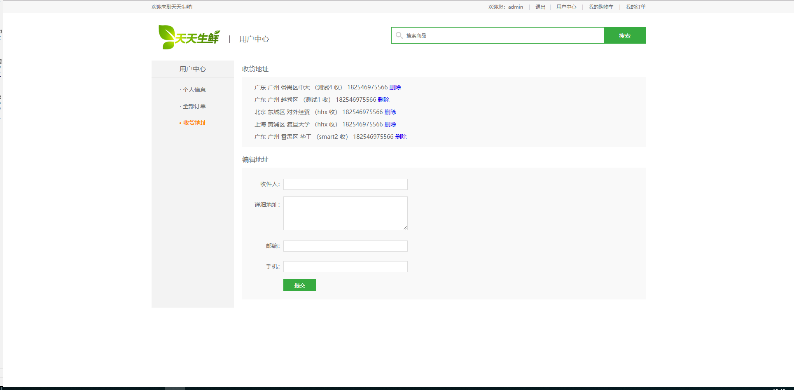
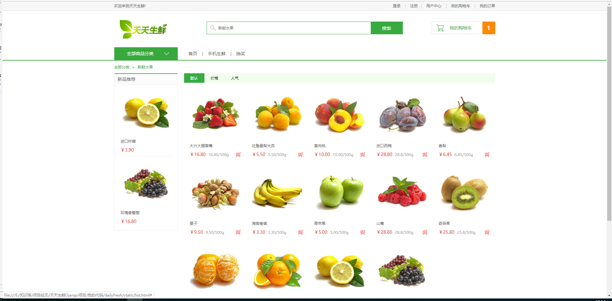
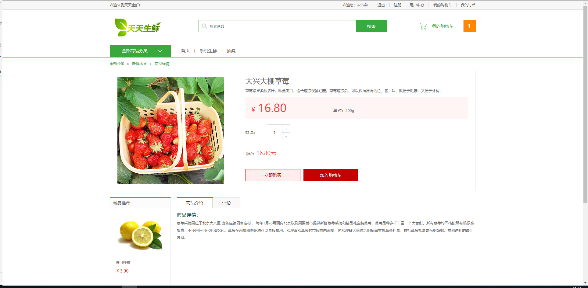
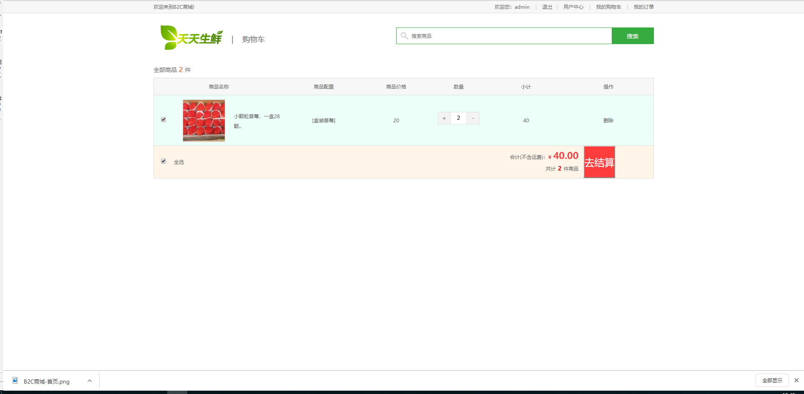
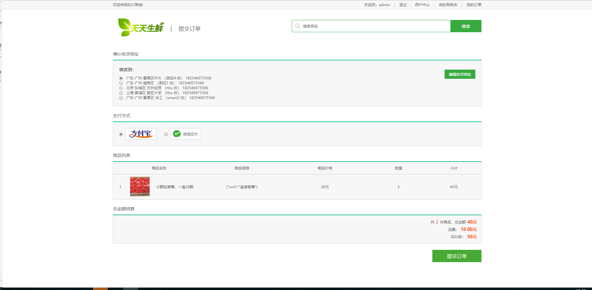
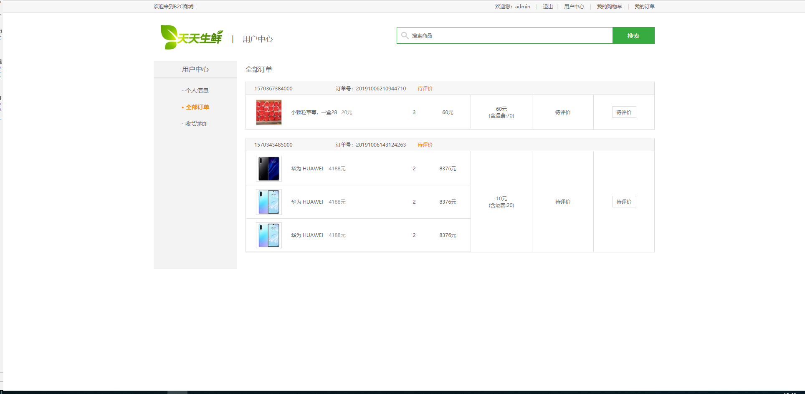
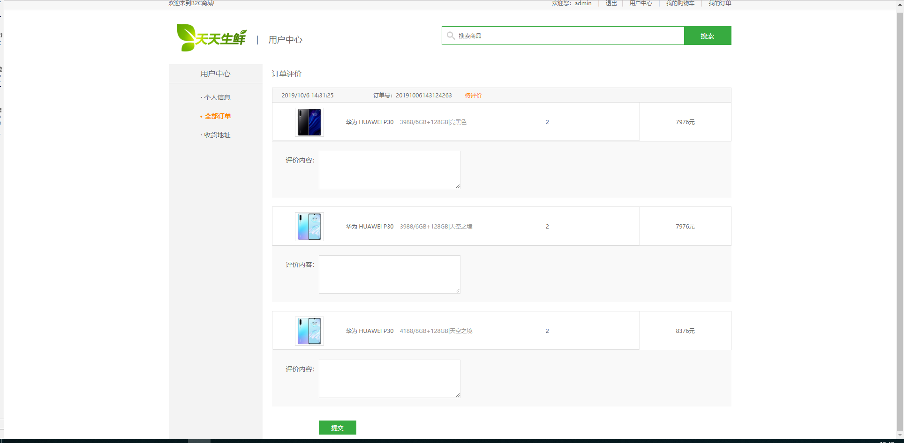

## 模块划分

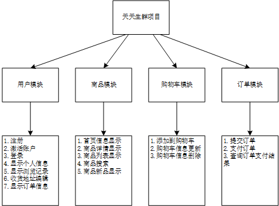

# 开发介绍

语言： Java

数据库：Redis + MySQL

其他技术：
- Celery: 分布式任务队列系统，用于发送激活邮件
- FastDFS: 分布式文件系统，用于存储图片
- Nginx: 静态资源代理服务器+反向代理服务器

## 目录结构说明

- `src` 目录：项目程序
    -  `java` 目录：存放源代码
    - `resources` 目录：存放配置文件和映射文件
        - `img` 目录：存放图片数据
        - `mapper` 目录：存放 mybatis 映射文件
        - `spring` 目录：存放spring配置文件。其中
            1. `spring-dao.xml`：负责使用mybatis建立数据库连接，提供数据源，
            2. `spring-service.xml`：与service层关联，负责设置事务管理器，
            3. `spring-mvc.xml`：配置springMVC,主要负责扫描controller、找静态文件、视图解析器、开启springMVC注解
    - `test` 目录：存放单元测试代码
- `webapp` 目录：存放网页资源
    - `resources` 目录：存放 css、js 文件
    - `WEB-INF` 目录：存放 web.xml 和 html 文件
    - `web.xml` ：负责DispatcherServlet和一些自定义Filter的配置
    
# 项目层次

- `Dao` 层：负责与数据库打交道。返回的结果是 POJO。如果产生异常，则往上抛
- `Service` 层：业务层，返回结果是 Dto 结构。如果产生异常，则往上抛
-  `Controller` 层：请求处理层。返回结果是 JSON。只有这层处理异常